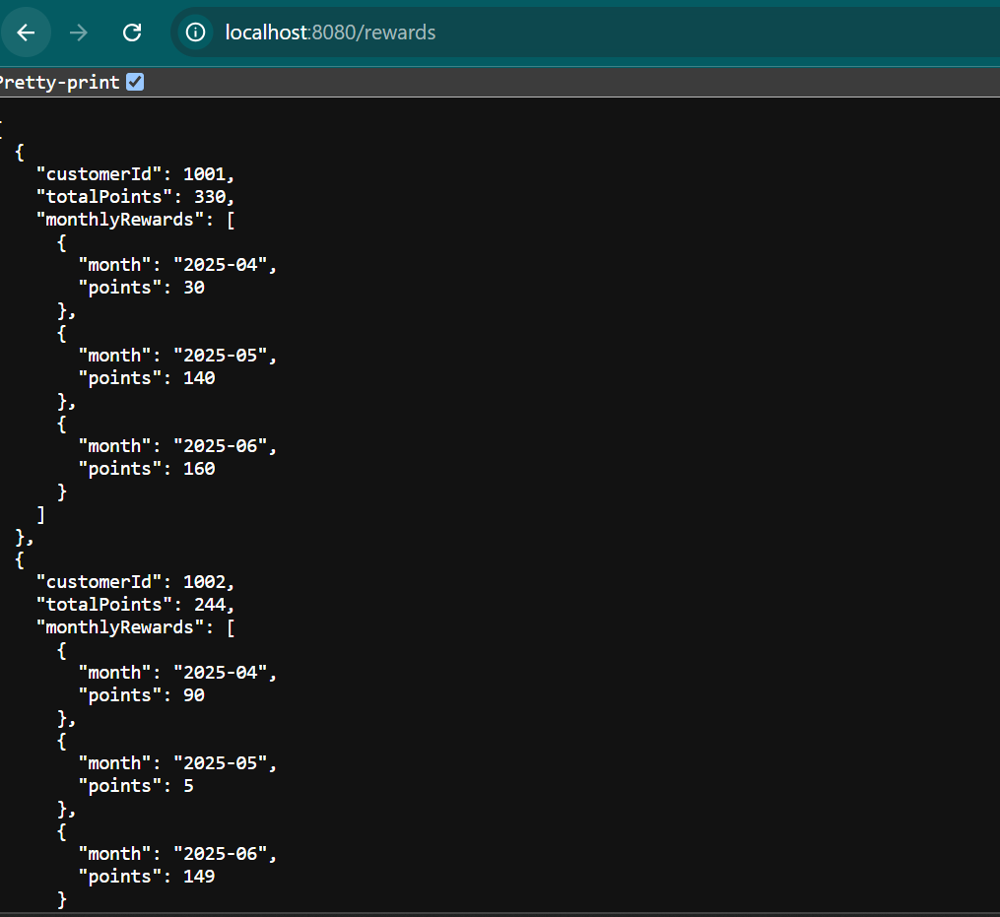
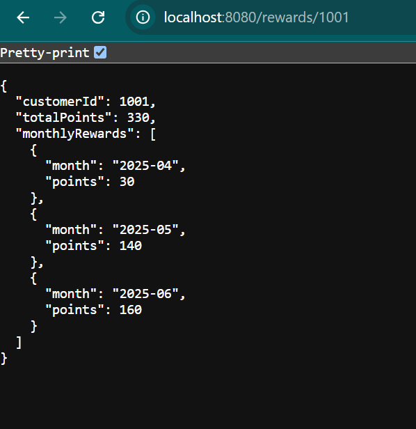

# Rewards Program Spring Boot API

A RESTful API for a retailer rewards program, calculating points for customers based on their purchase history.

## How to run the application

- Run the application by using tomact server locally URL(http://localhost:8080/rewards)  

- 


- 

## Reward Calculation Rules

- 2 points for every $1 spent **over $100** in each transaction  
- 1 point for every $1 spent **between $50 and $100** in each transaction  
- No points for $50 or less

**Example:**  
A $140 purchase earns 90 points:  
- 2 × $40 (over $100) = 80  
- 1 × $50 (from $50 to $100) = 50  
- **Total = 130 points**

## API Specification

### 1. Get All Rewards for All Customers

**GET** `/rewards`

- **Description:** Returns monthly and total rewards for every customer in the system.

**Response** (`200 OK`)
```json
[
  {
    "customerId": 1001,
    "totalPoints": 170,
    "monthlyRewards": [
      {
        "month": "2025-04",
        "points": 30
      },
      {
        "month": "2025-05",
        "points": 140
      }
    ]
  },
  {
    "customerId": 1002,
    "totalPoints": 95,
    "monthlyRewards": [
      {
        "month": "2025-04",
        "points": 90
      },
      {
        "month": "2025-05",
        "points": 5
      }
    ]
  },
]
```

### 2. Get Rewards for Customer by customer Id

**GET** `/rewards/{customerId}`

**Description:** Returns monthly and total rewards for one customer in the system.

**Response** (`200 OK`)
```json

  {
    "customerId": 1001,
    "totalPoints": 170,
    "monthlyRewards": [
      {
        "month": "2025-04",
        "points": 30
      },
      {
        "month": "2025-05",
        "points": 140
      }
    ]
  }
```

### 3. Get Transaction for Customer by customer Id

**GET** `/transactions/{customerId}`

**Description:** Returns transactions for one customer.

**Response** (`200 OK`)
```json

[
  {
    "id": 1,
    "customerId": 1001,
    "transactionAmount": 120.0,
    "transactionDate": "2025-05-11"
  },
  {
    "id": 2,
    "customerId": 1001,
    "transactionAmount": 80.0,
    "transactionDate": "2025-04-17"
  },
  {
    "id": 3,
    "customerId": 1001,
    "transactionAmount": 200.0,
    "transactionDate": "2025-03-12"
  }
]
```